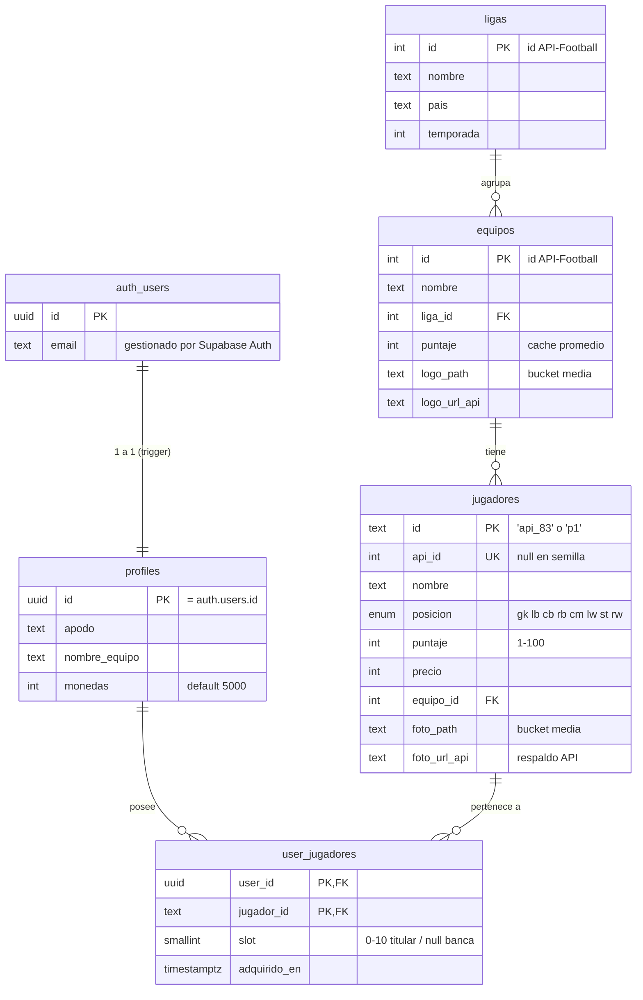

# Base de datos — Ultimate Team Manager

Esquema para **Supabase** (PostgreSQL + Storage), según el requerimiento
`[BE] Base de datos` del TODO.md. Los scripts viven en:

| Archivo | Contenido |
|---------|-----------|
| `supabase/migrations/20260716000000_esquema_inicial.sql` | Tablas, índices, trigger, RPCs, RLS y bucket |
| `supabase/seed.sql` | Liga 140, equipos 541/529/530 y los 21 jugadores semilla |

---

## Diagrama ER



Además del Postgres, un **bucket público `media`** en Supabase Storage guarda
las imágenes: `jugadores/{id}.png` y `equipos/{id}.png`.

---

## Correcciones sobre el schema del TODO

| TODO original | Corrección aplicada | Por qué |
|---------------|---------------------|---------|
| `Users.Password (HASH)` | Eliminada; auth con **Supabase Auth** + tabla `profiles` 1-a-1 | Supabase ya gestiona las contraseñas de forma segura; duplicar hashes es riesgoso e innecesario (README: "Supabase: Auth + Postgres") |
| `Users -< Jugadores` **y** columna `Jugadores (JSON)` | Catálogo global `jugadores` + tabla puente `user_jugadores` | El modelo del TODO era contradictorio (relación y JSON a la vez) y con un FK directo dos usuarios no podrían tener al mismo jugador. El mercado = catálogo menos los propios |
| `Jugadores` sin nombre ni posición | Se agregan `nombre` y `posicion` | Las cartas de la app muestran ambos y la alineación 4-3-3 requiere la posición |
| `Equipos.Jugadores` (lista) | Eliminada | La cubre el FK `jugadores.equipo_id` |
| `Equipos.Liga` (texto suelto) | Tabla `ligas` normalizada | Ids reales de API-Football; evita strings repetidos |
| Sin monedas | `profiles.monedas int default 5000` | RF4 del README; el TODO las omitía |
| — (detectado al diseñar) | Puesto del titular = `slot smallint 0-10`, no la posición | El 4-3-3 repite posiciones (2 DFC, 3 MC); un índice único por (usuario, posición) rompería. `slot` indexa `kFormation433` de la app; `null` = banca |

---

## Decisiones de diseño

- **PK de texto en `jugadores`** (`'api_83'`, `'p1'`): calza sin fricción con
  los `String id` que ya usa la entidad `Player` de la app; `api_id int
  unique` para los que vienen de la API.
- **RPCs atómicos `comprar_jugador` / `vender_jugador`** (`security definer`):
  la compra bloquea el perfil (`for update`), valida saldo y hace el insert +
  descuento en una sola transacción — sin carreras ni trampas desde el
  cliente. Errores tipados: `MONEDAS_INSUFICIENTES`, `YA_ES_TUYO`,
  `NO_VENDIBLE`, `JUGADOR_INEXISTENTE`. Vender exige `slot is null`
  (**los titulares no se venden**, regla de la app).
- **RLS**: perfil y plantilla solo del dueño; catálogos con lectura pública y
  escritura para autenticados — el **rellenado progresivo** del catálogo lo
  hacen los propios clientes con sus créditos gratuitos de la API (tradeoff
  aceptado para un proyecto de curso; en producción pasaría por un backend
  con `service_role`).
- **Trigger `handle_new_user`**: al registrarse alguien en Supabase Auth se
  crea su `profiles` con 5000 monedas y apodo desde los metadatos (o el
  prefijo del email).

## Estrategia de rellenado progresivo

1. La app consulta API-Football (plan gratuito, **100 peticiones/día**) al
   navegar el mercado, con caché local de 24 h.
2. Cada jugador/equipo recibido se **upserta** al catálogo compartido
   (`jugadores`, `equipos`): el gasto de créditos de un usuario beneficia a
   todos.
3. Las fotos pueden espejarse al bucket `media` (`foto_path`); mientras no
   exista copia, la app usa `foto_url_api`. Así el juego deja de depender de
   que api-sports.io sirva las imágenes para siempre.

## Mapa app ↔ base de datos

| App (hoy, offline) | Base de datos |
|--------------------|---------------|
| `Player.id / name / rating / position / price / photoUrl` | `jugadores.id / nombre / puntaje / posicion / precio / (foto_path ?? foto_url_api)` |
| `SquadState.players` (11 titulares con puesto exacto) | `user_jugadores.slot 0-10` (índice en `kFormation433`) |
| `SquadState.bench` | `user_jugadores.slot null` |
| `coinsProvider` (SharedPreferences) | `profiles.monedas` |
| `MarketController.buy()` | `rpc('comprar_jugador')` |
| `MarketController.sell()` + lista `soldPlayers` | `rpc('vender_jugador')` — al borrar la fila el jugador "vuelve al mercado" solo, sin lista aparte |
| Login demo offline (`AuthRepositoryLocal`) | Supabase Auth (`AuthRepositorySupabase` futuro, mismo contrato) |

## Cómo crear la base de datos (cuando toque)

### Opción A — Dashboard (sin instalar nada)
1. Crear el proyecto en [supabase.com](https://supabase.com) (región cercana).
2. **SQL Editor** → pegar el contenido de
   `supabase/migrations/20260716000000_esquema_inicial.sql` → **Run**.
3. Pegar y ejecutar `supabase/seed.sql`.
4. Verificar en **Table Editor** (5 tablas) y **Storage** (bucket `media`).

### Opción B — Supabase CLI
```bash
supabase init            # genera supabase/config.toml (no versionado aún)
supabase login
supabase link --project-ref <ref-del-proyecto>
supabase db push         # aplica las migraciones de supabase/migrations/
psql "$DATABASE_URL" -f supabase/seed.sql   # o pegar seed.sql en el editor
```

> Las credenciales del proyecto (URL + anon key) irán en `.env` — que ya está
> en `.gitignore` — cuando se conecte la app.
