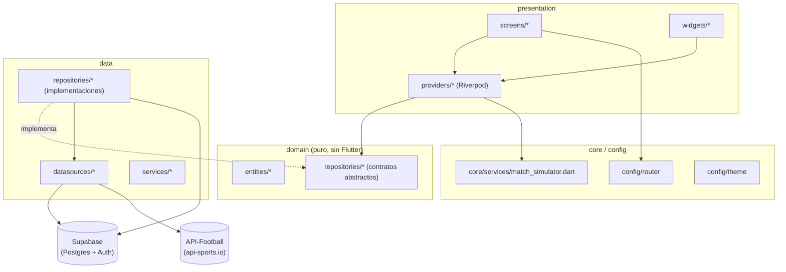
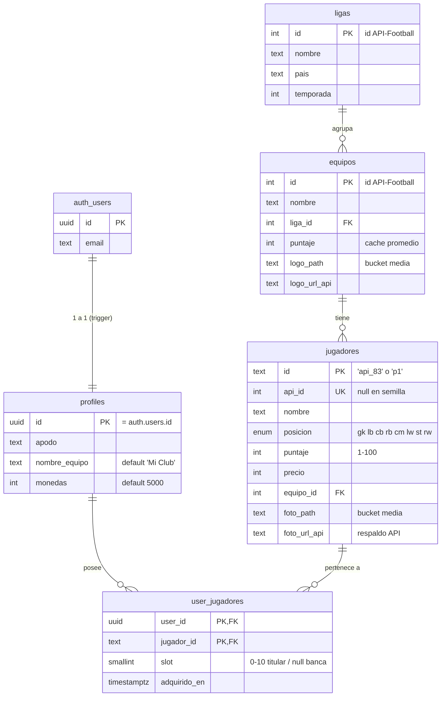
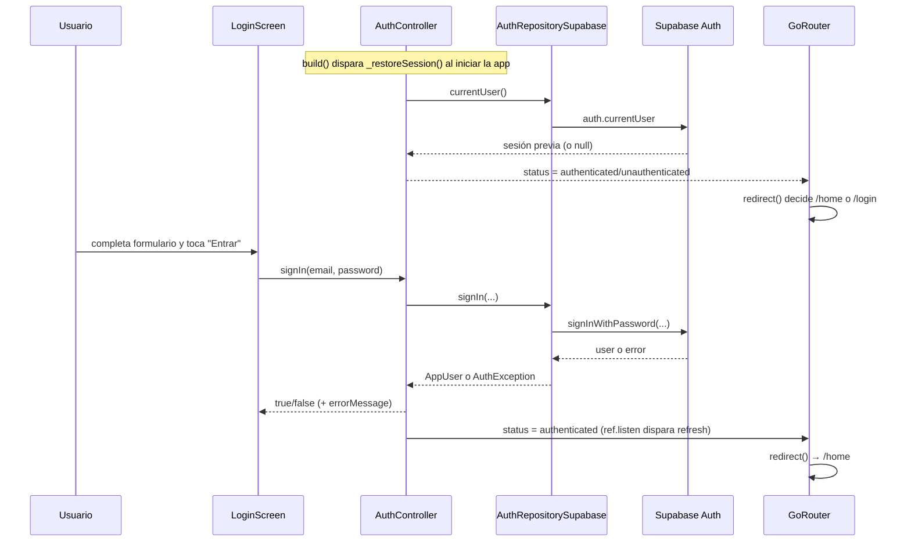
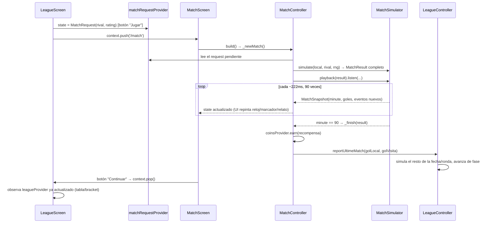

# Documentación técnica — Ultime Team Manager

> Documento de referencia completo del código fuente: qué hace cada archivo, qué
> widgets construye y en qué orden, cómo se conecta con APIs externas y con
> Supabase, qué dependencias usa el proyecto y para qué sirve cada una. Pensado
> para que cualquiera (incluido el propio equipo, meses después) entienda el
> 100% del código sin tener que releerlo línea a línea.
>
> Generado a partir del estado real del código en la rama `main` (no de la
> planificación original, que vive en `docs/planificacion/` y puede diferir de
> lo finalmente implementado). Cuando algo cambió respecto a la planificación,
> se indica explícitamente.

**Índice**

1. [Resumen del proyecto](#1-resumen-del-proyecto)
2. [Requerimientos funcionales → dónde viven en el código](#2-requerimientos-funcionales--dónde-viven-en-el-código)
3. [Stack y dependencias (`pubspec.yaml`)](#3-stack-y-dependencias-pubspecyaml)
4. [Arquitectura por capas](#4-arquitectura-por-capas)
5. [Estructura de carpetas](#5-estructura-de-carpetas)
6. [Variables de entorno y configuración](#6-variables-de-entorno-y-configuración)
7. [Arranque de la app: `main.dart`](#7-arranque-de-la-app-maindart)
8. [Enrutamiento: `app_router.dart`](#8-enrutamiento-app_routerdart)
9. [Tema visual: `app_colors.dart`](#9-tema-visual-app_colorsdart)
10. [Capa `domain`](#10-capa-domain)
11. [Capa `data`](#11-capa-data)
12. [Base de datos Supabase](#12-base-de-datos-supabase)
13. [Conexión con API-Football](#13-conexión-con-api-football)
14. [Capa `presentation` — providers (estado, Riverpod)](#14-capa-presentation--providers-estado-riverpod)
15. [Capa `presentation` — pantallas (widget por widget)](#15-capa-presentation--pantallas-widget-por-widget)
16. [Capa `presentation` — widgets reutilizables](#16-capa-presentation--widgets-reutilizables)
17. [`core/services` — el motor de simulación](#17-coreservices--el-motor-de-simulación)
18. [Flujos completos de extremo a extremo](#18-flujos-completos-de-extremo-a-extremo)
19. [Tests](#19-tests)
20. [Assets](#20-assets)
21. [Carpetas vacías / preparadas para crecer](#21-carpetas-vacías--preparadas-para-crecer)
22. [Cosas a tener en cuenta / deuda conocida](#22-cosas-a-tener-en-cuenta--deuda-conocida)

---

## 1. Resumen del proyecto

**Ultime Team Manager** es una app Flutter/Dart tipo *FC Ultimate Team*: el
jugador arma un 11 titular (formación fija 4-3-3), compra y vende cartas de
futbolistas en un mercado, simula partidos contra rivales y compite en una
liga (grupos + eliminatorias) que reparte monedas según el resultado.

El nombre interno del paquete Dart sigue siendo `contador_app` (heredado del
proyecto base de la Unidad 1, un contador con `setState`; ver
`lib/presentation/screens/counter/counter_screen.dart`, que ya no está
enrutado pero se conserva en el repo). Por eso **todos los imports internos
empiezan con `package:contador_app/...`** aunque el proyecto se llame "Ultime
Team Manager" de cara al usuario.

- **Package name real:** `contador_app` (`pubspec.yaml:1`)
- **Backend:** Supabase (Postgres + Auth + Storage), ya migrado desde el
  diseño original 100% local/offline.
- **Origen de datos de jugadores:** API-Football (api-sports.io), inyectada
  progresivamente en el catálogo compartido de Supabase.
- **Gestión de estado:** Riverpod (`flutter_riverpod`), con `Notifier` /
  `AutoDisposeNotifier` por feature.
- **Navegación:** `go_router`, con guardia de sesión basada en el estado de
  autenticación.

---

## 2. Requerimientos funcionales → dónde viven en el código

Tomados de `README.md` (sección "Requerimientos funcionales"), con el mapeo
real al código actual:

| # | Requerimiento | Implementación |
|---|---|---|
| **RF1** | Login y sesión, offline hoy → escalable a online | `AuthRepositorySupabase` (`lib/data/repositories/auth_repository_supabase.dart`) + `AuthController` (`lib/presentation/providers/auth_provider.dart`) + `LoginScreen`. El contrato `AuthRepository` también tiene una implementación local de respaldo (`AuthRepositoryLocal`) sin usar actualmente. |
| **RF2** | Plantilla 11 (4-3-3) | `SquadScreen` + `kFormation433` (`lib/presentation/widgets/squad/formation_layout.dart`) + `SquadController`/`SquadState` + `SquadRepositorySupabase` (tabla `user_jugadores`). |
| **RF3** | Cartas (rating, posición, precio) | Entidad `Player` (`lib/domain/entities/player.dart`), widget `PlayerCard`. |
| **RF4** | Monedas | `CoinsController` (`lib/presentation/providers/coins_provider.dart`), columna `profiles.monedas` en Supabase. |
| **RF4** | Mercado (CRUD comprar/vender) | `MarketScreen` + `MarketController`/`MarketState` + `MarketRepositorySupabase` (tabla `jugadores`). |
| **RF5** | Simulación de partidos por valoración media | `MatchSimulator` (`lib/core/services/match_simulator.dart`, función pura) + `MatchController` + `MatchScreen`. |
| **RF6** | Liga: varios equipos, reparto de monedas por resultado | `LeagueController` (`lib/presentation/providers/league_provider.dart`) + `LeagueSim` (`lib/data/services/league_engine.dart`) + `LeagueScreen`. |

Documentos de diseño relacionados (histórico, útiles para entender el *por
qué* de ciertas decisiones, pero el código es la fuente de verdad):
`docs/liga/implementacion-liga.md`, `docs/partido/logica-simulacion.md`,
`docs/partido/implementacion-logica-simulacion.md`,
`docs/supabase/migracion-supabase.md`, `docs/db/schema.md`.

---

## 3. Stack y dependencias (`pubspec.yaml`)

### `dependencies` (van al build final)

| Paquete | Versión | Para qué se usa en este proyecto |
|---|---|---|
| `flutter` (sdk) | — | Framework base. |
| `flutter_riverpod` | `^2.6.1` | Gestión de estado de toda la app: un `Provider`/`NotifierProvider` por feature (auth, monedas, plantilla, mercado, partido, liga). Desacopla la UI de la lógica y permite testear controladores sin widgets. |
| `go_router` | `^14.6.2` | Enrutamiento declarativo (`lib/config/router/app_router.dart`). Define las 6 rutas de la app y una guardia (`redirect`) que fuerza `/login` si no hay sesión. |
| `supabase_flutter` | `^2.16.0` | Cliente de Supabase: Auth (`GoTrueClient`), Postgres (`SupabaseClient.from(...)`) y (potencialmente) Storage. Es el backend real de auth, mercado, plantilla y monedas. |
| `shared_preferences` | `^2.3.3` | Persistencia local ligera: sesión offline de respaldo (`AuthRepositoryLocal`), caché de 24h del mercado (`MarketRepositoryApi`), lista de "vendidos" del mercado (`MarketController`), plantilla local de respaldo (`SquadRepositoryLocal`). |
| `http` | `^1.2.2` | Cliente HTTP usado por `ApiFootballDatasource` para llamar a la API pública de fútbol. |
| `flutter_dotenv` | `^5.2.1` | Carga variables de entorno desde el archivo `.env` (empaquetado como asset) — claves de Supabase y de API-Football. |
| `audioplayers` | `^6.8.1` | Reproduce la música de intro en loop en la pantalla de login (`IntroMusic`). |
| `cupertino_icons` | `^1.0.8` | Set de iconos estilo iOS (dependencia estándar del template de Flutter). |

### `dev_dependencies` (solo en desarrollo/build, no van a producción)

| Paquete | Para qué |
|---|---|
| `flutter_test` (sdk) | Framework de testing de Flutter (`test/*.dart`). |
| `flutter_lints` `^6.0.0` | Reglas de lint (`analysis_options.yaml`) para mantener el código consistente. |
| `flutter_native_splash` `^2.4.8` | Genera la splash screen nativa (Android/iOS/web) a partir de `flutter_native_splash.yaml` y `assets/images/pantallaCarga.*`. |
| `flutter_launcher_icons` `^0.14.4` | Genera los íconos de la app (Android adaptativo + iOS) a partir de `assets/icon/icon.png` / `icon_foreground.png`, configurado al final de `pubspec.yaml`. |

### Assets declarados

```yaml
assets:
  - .env
  - assets/images/
  - assets/data/squad.json
  - assets/sounds/music/intro.mp3
```

`.env` se empaqueta como asset (no como secreto de build) porque el proyecto
es un trabajo académico offline-first; `flutter_dotenv` lo lee en runtime.

---

## 4. Arquitectura por capas

Arquitectura por capas, inspirada en Clean Architecture:



Regla clave: **la UI y los providers nunca dependen directamente de Supabase
o de `http`** — siempre pasan por un contrato en `domain/repositories`. Eso es
lo que permitió migrar de almacenamiento 100% local a Supabase sin tocar
pantallas (solo se cambió qué implementación se inyecta en cada
`Provider<XRepository>`).

---

## 5. Estructura de carpetas

```
lib/
├── main.dart                              # arranque: dotenv + Supabase + ProviderScope
├── config/
│   ├── router/app_router.dart             # go_router: rutas + guardia de sesión
│   ├── theme/app_colors.dart              # paleta de colores única del proyecto
│   └── constants/                         # (vacía, .gitkeep — reservada)
├── core/
│   ├── services/match_simulator.dart      # motor puro de simulación de partidos
│   ├── errors/                            # (vacía, .gitkeep — reservada)
│   └── utils/                             # (vacía, .gitkeep — reservada)
├── data/
│   ├── league_teams.dart                  # 15 clubes reales con rating artificial (rivales)
│   ├── datasources/api_football_datasource.dart
│   ├── repositories/
│   │   ├── auth_repository_local.dart     # implementación offline (no usada hoy)
│   │   ├── auth_repository_supabase.dart  # implementación real (activa)
│   │   ├── market_repository_api.dart     # implementación contra API-Football (no usada hoy)
│   │   ├── market_repository_supabase.dart# implementación real (activa)
│   │   ├── squad_repository_local.dart    # implementación offline (no usada hoy)
│   │   └── squad_repository_supabase.dart # implementación real (activa)
│   ├── services/league_engine.dart        # helpers puros para simular partidos de liga
│   └── models/                            # (vacía, .gitkeep — reservada)
├── domain/
│   ├── entities/
│   │   ├── app_user.dart
│   │   ├── league.dart
│   │   ├── league_team.dart
│   │   ├── match_event.dart
│   │   ├── match_result.dart
│   │   ├── player.dart
│   │   └── squad.dart
│   ├── repositories/
│   │   ├── auth_repository.dart           # contrato + AuthException
│   │   ├── market_repository.dart         # contrato + MarketException/MarketErrorKind
│   │   └── squad_repository.dart          # contrato
│   └── usecases/                          # (vacía, .gitkeep — reservada)
└── presentation/
    ├── providers/
    │   ├── auth_provider.dart
    │   ├── coins_provider.dart
    │   ├── league_provider.dart
    │   ├── market_provider.dart
    │   ├── match_provider.dart
    │   └── squad_provider.dart
    ├── screens/
    │   ├── auth/login_screen.dart
    │   ├── counter/counter_screen.dart    # pantalla base heredada, NO enrutada
    │   ├── home/home_screen.dart
    │   ├── league/league_screen.dart
    │   ├── market/market_screen.dart
    │   ├── match/match_screen.dart
    │   └── squad/squad_screen.dart
    └── widgets/
        ├── coins_chip.dart
        ├── crest_logo.dart
        ├── intro_music.dart
        ├── pitch_background.dart
        ├── player_list_row.dart
        └── squad/
            ├── average_rating_header.dart
            ├── formation_layout.dart
            ├── pitch_geometry.dart
            ├── player_bench_sheet.dart
            ├── player_card.dart
            └── squad_pitch_background.dart
```

`test/` (raíz del proyecto) contiene los tests, ver [sección 19](#19-tests).
`supabase/` contiene la migración SQL aplicada y el seed. `docs/` contiene
documentación de diseño previa (planificación, liga, partido, supabase, db,
tutoriales). `assets/` contiene imágenes, sonidos, íconos y la semilla JSON de
la plantilla. `mockups/` contiene los HTML estáticos que sirvieron de
referencia visual para las pantallas de liga y partido.

---

## 6. Variables de entorno y configuración

`.env` (no versionado; ver `.env.example`) provee, vía `flutter_dotenv`:

| Variable | Usada en | Para qué |
|---|---|---|
| `SUPABASE_URL` | `lib/main.dart` | URL del proyecto Supabase. |
| `SUPABASE_ANON_KEY` | `lib/main.dart` | Clave pública (anon) de Supabase, pasada como `publishableKey` a `Supabase.initialize`. |
| `API_KEY` | `lib/data/datasources/api_football_datasource.dart` | Clave de API-Football (header `x-apisports-key`). |

`.env.example` solo documenta `API_KEY` (quedó desactualizado tras la
migración a Supabase; en la práctica hacen falta las 3 variables). Si falta
`.env` o falla su carga, `main.dart` captura el error y la app arranca
igual (las funciones que dependen de red se degradan en vez de crashear).

---

## 7. Arranque de la app: `main.dart`

`lib/main.dart` — punto de entrada.

1. `WidgetsFlutterBinding.ensureInitialized()`.
2. `await dotenv.load()` dentro de un `try/catch` — si falla, solo hace
   `debugPrint` y sigue.
3. `await Supabase.initialize(url: ..., publishableKey: ...)` dentro de otro
   `try/catch` con la misma lógica de degradación suave.
4. `runApp(const ProviderScope(child: MyApp()))` — `ProviderScope` es el nodo
   raíz de Riverpod, obligatorio para que cualquier `Provider` funcione en el
   árbol de widgets.

`MyApp` es un `ConsumerWidget` (no `StatelessWidget`, porque necesita leer
`routerProvider` desde Riverpod). Su `build`:
- `ref.watch(routerProvider)` obtiene el `GoRouter` configurado.
- Devuelve un `MaterialApp.router` con:
  - `debugShowCheckedModeBanner: false`
  - `theme: ThemeData(useMaterial3: true, colorSchemeSeed: Colors.green)` —
    tema base de Material 3 con semilla verde (coherente con la paleta de
    `AppColors`, aunque las pantallas casi todas fijan sus propios colores
    "a mano" en vez de usar el `Theme`).
  - `routerConfig: router`.

---

## 8. Enrutamiento: `app_router.dart`

`lib/config/router/app_router.dart` expone `routerProvider` (`Provider<GoRouter>`).

**Guardia de sesión reactiva:** crea un `ValueNotifier<AuthStatus> refresh` y
usa `ref.listen(authControllerProvider.select((s) => s.status), ...)` para
actualizarlo cada vez que cambia el estado de auth (con `fireImmediately:
true` para tener el valor inicial). Ese `refresh` se pasa como
`refreshListenable` al `GoRouter`, así **el router reacciona solo** cuando el
usuario inicia/cierra sesión, sin necesidad de navegación manual desde la UI.

**Lógica de `redirect`:**
```
status == unknown        → no decide nada (se está restaurando la sesión)
!loggedIn && !loggingIn  → manda a /login
loggedIn && loggingIn    → manda a /home
en cualquier otro caso   → no redirige
```

**Rutas registradas:**

| Ruta | Pantalla | Notas |
|---|---|---|
| `/login` | `LoginScreen` | `initialLocation` de la app. |
| `/home` | `HomeScreen` | Destino tras login exitoso. |
| `/squad` | `SquadScreen` | Plantilla 4-3-3. |
| `/market` | `MarketScreen` | Comprar/vender. |
| `/match` | `MatchScreen` | Simulación de partido (amistoso o de liga). |
| `/league` | `LeagueScreen` | Fase de grupos + eliminatorias. |

`errorBuilder` muestra `_NotFoundScreen` (widget privado del propio archivo)
para cualquier ruta no registrada: texto "Ruta no encontrada" + botón "Ir al
login" (`context.go('/login')`).

---

## 9. Tema visual: `app_colors.dart`

`lib/config/theme/app_colors.dart` — clase `AppColors` con constructor
privado (`AppColors._()`) para que actúe como namespace de constantes
estáticas, no instanciable. Paleta "verde de cancha sobre carbón mate"
(estética EA FC):

| Constante | Color | Uso típico |
|---|---|---|
| `verde` | `#2FE27A` | Acento principal: bordes activos, texto destacado, líneas de progreso. |
| `verde2` | `#12A355` | Verde profundo, degradados y estados "seleccionado". |
| `pildora` | `#4BD46A` | Botones de acción primaria ("Entrar", "Jugar", "Comprar"). |
| `oro` | `#EFC75D` | Exclusivo para el campeón de la liga (icono de trofeo, tarjeta dorada). |
| `fondo` | `#02060A` | Fondo casi negro de todas las pantallas. |
| `carbon` | `#0A0D0C` (≈90% opaco) | Tarjetas y superficies elevadas. |
| `borde` | blanco 10% opaco | Bordes sutiles de tarjetas/inputs. |
| `texto` | `#F4F7F9` | Texto principal. |
| `gris` | `#8B98A2` | Texto secundario, iconos apagados. |

Todas las pantallas y widgets del proyecto usan estos colores directamente
(no el `ColorScheme` de Material), por lo que este archivo es la única fuente
de verdad visual del proyecto.

---

## 10. Capa `domain`

Capa de reglas de negocio puras: **sin ningún import de Flutter ni de
paquetes de red/DB** (excepto `player.dart`, que sí puede importarse desde
Flutter pero no lo requiere). Aquí vive el "qué es cada cosa", no el "cómo se
guarda".

### 10.1 Entidades (`domain/entities`)

#### `app_user.dart`
`AppUser` — usuario autenticado: `id` (String), `email` (String). Clase
inmutable mínima, sin lógica.

#### `player.dart`
El corazón del modelo de datos.

- `enum PlayerPosition { gk, lb, cb, rb, cm, lw, st, rw }` — las 8 posiciones
  concretas del 4-3-3 (no solo líneas GK/DEF/MED/DEL), porque la alineación
  necesita distinguir, por ejemplo, lateral izquierdo de central.
  - Extensión `PlayerPositionX.displayLabel`: etiqueta corta en español para
    la insignia de la carta (`POR`, `LI`, `DFC`, `LD`, `MC`, `EI`, `DC`, `ED`).
  - Extensión `PlayerPositionX.group`: a qué línea pertenece cada posición
    (útil para colorear/agrupar/filtrar).
- `enum PlayerPositionGroup { goalkeeper, defense, midfield, attack }` — las 4
  líneas, con su propio `displayLabel` (`POR`, `DEF`, `MED`, `DEL`) usado en
  el dropdown de filtro del mercado.
- `class Player`: `id`, `name`, `rating` (1-100), `position`, `price`
  (monedas), `photoUrl?`.
  - `Player.priceForRating(rating)`: **curva de precio convexa** —
    `(rating³ / 500).round()` — para que los jugadores top cuesten
    desproporcionadamente más (70→686, 80→1024, 91→1507). Se usa como
    respaldo cuando el precio no viene explícito (semillas antiguas, o al
    mapear la respuesta de la API).
  - `firstName` / `lastName`: separa el nombre por el primer espacio, para
    pintar la carta en 2 líneas.
  - `copyWith({position})`: solo permite cambiar la posición (se usa al
    subir un suplente al 11 y que herede el puesto exacto del titular que
    reemplaza).
  - `toJson()` / `Player.fromJson()`: serialización manual a `Map`, usada
    tanto por el caché local del mercado (`SharedPreferences`) como por la
    semilla `assets/data/squad.json`.

#### `squad.dart`
`Squad` — snapshot simple: `starters` (11 titulares) + `bench` (suplentes
disponibles). Sin lógica; el promedio y los filtros viven en
`SquadState` (capa de presentación).

#### `league_team.dart`
`LeagueTeam` — un equipo rival con valoración **estimada** (dato artificial,
no viene de ninguna API): `name`, `country`, `rating` (1-100). Es la unidad
con la que trabaja toda la lógica de liga y partidos amistosos.

#### `league.dart`
Modelos de **snapshot inmutable** que consume la UI de la liga (el estado
mutable interno vive en `LeagueController`, ver [14.3](#143-league_providerdart)):

- `enum LeaguePhase { groups, quarters, semis, finalPhase, done }`
- `TeamStanding`: fila de tabla de grupo — `team`, `played`, `won`, `drawn`,
  `lost`, `goalsFor`, `goalsAgainst`; getters `points` (`won*3 + drawn`) y
  `goalDiff`.
- `GroupView`: `name` + `List<TeamStanding> table` (ya ordenada).
- `TieView`: un cruce de eliminatoria — `round`, `home`, `away`,
  `homeGoals?`, `awayGoals?`, `onPens`, `homePens`, `awayPens`; getters
  `played`, `winner` (por goles o por penales), `isWinner(team)`.
- `UltimeFixture`: el próximo partido pendiente del usuario — `rival` +
  `label` descriptivo ("Fase de grupos · Fecha 2", "Cuartos de final"...).
- `LeagueState`: el snapshot completo — grupos, `matchday`, `phase`,
  `quarters`, `semis`, `finalTie?`, `champion?`, `next?`, `ultimeEliminated`.

#### `match_event.dart`
- `enum MatchEventType { kickoff, goal, commentary, fullTime }`
- `enum MatchTeam { local, visita }`
- `MatchEvent`: `minute` (0-90), `type`, `team?` (null en relato/inicio/fin),
  `text`; getter `isGoal`.

#### `match_result.dart`
`MatchResult`: el partido completo ya simulado — nombres, ratings, marcador
final (`golLocal`/`golVisita`), y **todo** el `events` timeline en orden
cronológico. Getters `localWon`, `isDraw`, `visitaWon`, `scoreline`
(`"2 - 1"`).

### 10.2 Contratos de repositorio (`domain/repositories`)

Interfaces abstractas que la capa `data` implementa y que la capa
`presentation` consume — nunca al revés.

#### `auth_repository.dart`
```dart
abstract class AuthRepository {
  Future<AppUser?> currentUser();
  Future<AppUser> signIn({required String email, required String password});
  Future<AppUser> signUp({required String email, required String password, String? clubName});
  Future<void> signOut();
}
class AuthException implements Exception { final String message; ... }
```

#### `market_repository.dart`
```dart
abstract class MarketRepository {
  Future<List<Player>> fetchListings();
  Future<List<Player>> searchPlayers(String query); // la API exige mínimo 4 caracteres
}
enum MarketErrorKind { network, quota }
class MarketException implements Exception { final String message; final MarketErrorKind kind; ... }
```

#### `squad_repository.dart`
```dart
abstract class SquadRepository {
  Future<Squad> getSquad();
  Future<void> saveSquad(Squad squad);
}
```

No hay un `LeagueRepository` ni `MatchRepository`: la lógica de liga y
partido es **puramente en memoria/algorítmica** (no se persiste en Supabase
hoy — ver [22](#22-cosas-a-tener-en-cuenta--deuda-conocida)).

---

## 11. Capa `data`

Implementaciones concretas de los contratos de `domain`, más las fuentes de
datos externas (`datasources`) y servicios de dominio de datos
(`services`).

### 11.1 `league_teams.dart`

`lib/data/league_teams.dart` — **liga artificial**: constante
`kLeagueTeams`, los 15 mejores clubes reales del mundo (nombre, país y una
valoración *estimada a mano*, no obtenida de ninguna API), rating entre 79 y
85. Son los rivales tanto de los amistosos como de la liga jugable.

`randomRival(Random rng, {String? exclude})`: elige un equipo al azar,
opcionalmente excluyendo uno por nombre (usado para no enfrentar al usuario
contra el Real Madrid en los amistosos, por ejemplo).

### 11.2 Datasource remoto: `api_football_datasource.dart`

`ApiFootballDatasource` — cliente HTTP de **API-Football v3** (api-sports.io,
plan gratuito: 100 peticiones/día, temporadas 2021-2023). Documentado en
detalle en la [sección 13](#13-conexión-con-api-football).

### 11.3 Repositorios de autenticación

#### `auth_repository_local.dart` — `AuthRepositoryLocal` (implementación offline, **no inyectada actualmente**)
- Usuario demo fijo: `demo@ultime.com` / `123456`.
- `signIn`: simula 600ms de latencia, valida contra el demo, guarda
  `auth_user_id` / `auth_user_email` en `SharedPreferences`.
- `signUp`: siempre lanza `AuthException` ("El registro requiere conexión").
- `currentUser`: lee las claves de `SharedPreferences`.
- `signOut`: las borra.
- Se conserva en el código como implementación de referencia/fallback, pero
  `auth_provider.dart` hoy inyecta `AuthRepositorySupabase`.

#### `auth_repository_supabase.dart` — `AuthRepositorySupabase` (**activa**)
Envuelve `GoTrueClient` (`Supabase.instance.client.auth`):
- `currentUser()`: mapea `_auth.currentUser` (si existe) a `AppUser`.
- `signIn()`: `_auth.signInWithPassword(email, password)`.
- `signUp()`: `_auth.signUp(email, password, data: {apodo, nombre_equipo?})`
  — los metadatos alimentan el trigger `handle_new_user` de Postgres (ver
  [12](#12-base-de-datos-supabase)). Si `res.session == null` (falta
  confirmar el correo), lanza `AuthException` con un mensaje explicativo en
  vez de devolver un usuario "a medias".
- `signOut()`: `_auth.signOut()`.
- `_friendly(e)`: traduce mensajes crudos de Supabase/GoTrue a español
  legible (credenciales inválidas, correo repetido, contraseña corta, correo
  sin confirmar, sin conexión) — evita mostrarle al usuario un stack trace en
  inglés.

### 11.4 Repositorios de mercado

#### `market_repository_api.dart` — `MarketRepositoryApi` (**no inyectada actualmente**, quedó como implementación de referencia previa a Supabase)
- `fetchListings()`: pide en **paralelo** (`Future.wait`) los planteles de
  los 16 equipos de `ApiFootballDatasource.marketTeams`, cada uno pasando
  por caché (`_cached`); si algún equipo falla pero otro respondió, se
  muestra lo que haya en vez de fallar todo (`firstError` se guarda pero
  solo se relanza si **ningún** equipo trajo datos). Deduplica jugadores por
  `id` (un jugador puede figurar en dos respuestas).
- `searchPlayers(query)`: también cacheado, clave
  `market_cache_search_<query>`.
- `_cached(key, fetch)`: caché en `SharedPreferences` con TTL de 24h
  (`_ttl`). Si la caché está vigente, ni siquiera toca la red. Si la red o la
  cuota fallan pero hay una entrada vencida, la devuelve igual ("mejor datos
  viejos que ninguno").

#### `market_repository_supabase.dart` — `MarketRepositorySupabase` (**activa**)
Lee directamente de la tabla `jugadores` en Supabase (no llama a la API
desde el cliente para listar):
- `fetchListings()`: `select('id, nombre, puntaje, posicion, precio,
  foto_url_api')`, `order('puntaje', desc)`, `limit(400)`.
- `searchPlayers(query)`: mismo `select` + `.ilike('nombre', '%query%')`,
  `limit(60)`.
- `_toPlayer(row)`: mapea la fila (columnas en español) a la entidad
  `Player` (campos en inglés) — este mapeo es el puente de nombres entre el
  schema de Postgres y el dominio de la app.
- Errores de Postgrest se envuelven en `MarketException` con
  `MarketErrorKind.network` (no distingue cuota aquí, porque ya no llama a la
  API directamente).

### 11.5 Repositorios de plantilla

#### `squad_repository_local.dart` — `SquadRepositoryLocal` (**no inyectada actualmente**)
- Semilla desde `assets/data/squad.json` (vía `rootBundle.loadString`).
- Versión de semilla (`_seedVersion = 2`): si la versión guardada en
  `SharedPreferences` no coincide, descarta la plantilla vieja y recarga la
  semilla — mecanismo para forzar una recarga cuando cambia el contenido de
  la semilla (p. ej. al pasar de jugadores inventados a reales) sin tener que
  desinstalar la app.
- `saveSquad()`: serializa `starters`/`bench` a JSON en `SharedPreferences`.

#### `squad_repository_supabase.dart` — `SquadRepositorySupabase` (**activa**)
La más elaborada de las implementaciones Supabase:
- **Codificación del puesto:** el `slot` (columna de `user_jugadores`) define
  a la vez si el jugador es titular o suplente y, si es titular, qué puesto
  exacto ocupa. `_formation` es la lista fija de 11 posiciones en el orden
  del 4-3-3 (índice = slot). `_benchBase = 100`: cualquier `slot >= 100` es
  banca.
- `getSquad()`:
  1. `select('slot, jugadores(id,nombre,puntaje,posicion,precio,foto_url_api)')`
     con join implícito de PostgREST, filtrado por `user_id`, ordenado por
     `slot`.
  2. Si no hay filas (usuario nuevo), llama a `_seedSquad(uid)`.
  3. Si no, separa titulares (`slot < 100`, posición forzada según
     `_formation[slot]`) de banca (`slot >= 100`, posición del catálogo).
- `saveSquad()`: **borra y reinserta todo** (`delete().eq('user_id', uid)` +
  `insert(rows)`) — simple y consistente a esta escala, aunque no es la
  estrategia más eficiente para plantillas grandes. Envuelto en `try/catch`
  silencioso ("best-effort": sin conexión no rompe la UI).
- `_seedSquad(uid)`: arma un 11 inicial automático para un usuario nuevo,
  tomando del catálogo (que hoy solo trae `gk/cb/cm/st`, ver
  [12](#12-base-de-datos-supabase)) el mejor disponible por **línea**
  (`PlayerPositionGroup`) y asignándole el puesto exacto de `_formation`; la
  banca recibe un relevo por línea. Al final, persiste con `saveSquad`.

### 11.6 `services/league_engine.dart` — `LeagueSim`

Helpers **puros** (sin estado, sin Riverpod) usados por `LeagueController`
para resolver partidos de la liga que el usuario no juega en vivo:

- `LeagueSim.score(a, b, Random r)`: delega en `MatchSimulator.simulate(...)`
  (mismo motor que los partidos "en vivo") y devuelve solo el marcador final
  `(golLocal, golVisita)` como record.
- `LeagueSim.pens(a, b, Random r)`: tanda de penales simulada — favorece
  probabilísticamente al equipo de mayor rating
  (`P(a gana) = a.rating / (a.rating + b.rating)`), con un marcador
  "realista" tipo 4-3 (`perdedor` entre 2 y 4, `ganador = perdedor + 1`).

---

## 12. Base de datos Supabase

Esquema aplicado: `supabase/migrations/20260716000000_esquema_inicial.sql`
(244 líneas), con datos semilla en `supabase/seed.sql`. Documentado también
en prosa en `docs/db/schema.md` (diagrama ER, decisiones de diseño y
correcciones sobre el schema original del TODO del curso).

> Nota: existe un segundo documento, `docs/supabase/schema.sql` +
> `docs/supabase/migracion-supabase.md`, con nombres de tabla **en inglés**
> (`players`, `squad_players`, `leagues`...). Ese fue un **borrador de
> planificación anterior**; el esquema realmente aplicado y con el que habla
> el código (`jugadores`, `user_jugadores`, `equipos`, `ligas`, `profiles`)
> es el de `supabase/migrations/`. No hay tablas de `leagues` /
> `league_teams` / `league_ties` / `match_history` aplicadas — la liga vive
> solo en memoria (`LeagueController`), ver [22](#22-cosas-a-tener-en-cuenta--deuda-conocida).

### 12.1 Diagrama ER (esquema real)



### 12.2 Tablas

| Tabla | Columnas clave | RLS |
|---|---|---|
| `ligas` | `id` (PK, id de API-Football), `nombre`, `pais`, `temporada` | Lectura pública; insert/update solo autenticados. |
| `equipos` | `id` (PK, id de API-Football), `nombre`, `liga_id` (FK), `puntaje` (1-100, caché del promedio del plantel), `logo_path`, `logo_url_api` | Igual que `ligas`. |
| `jugadores` | `id` (PK texto, `'api_83'` o `'p1'`), `api_id` (único, null en semilla), `nombre`, `posicion` (enum), `puntaje` (1-100), `precio` (>0), `equipo_id` (FK), `foto_path`, `foto_url_api` | Catálogo compartido: lectura pública, insert/update para autenticados (el "rellenado progresivo" lo hacen los propios clientes con su cuota gratuita de API-Football). Índices en `puntaje desc` (orden del mercado) y `equipo_id`. |
| `profiles` | `id` (PK = `auth.users.id`), `apodo`, `nombre_equipo`, `monedas` (≥0, default 5000) | Select/update solo del propio dueño; el insert lo hace el trigger, no el cliente. |
| `user_jugadores` | `user_id` + `jugador_id` (PK compuesta), `slot` (0-10 o null), `adquirido_en` | CRUD completo solo de las filas propias (`user_id = auth.uid()`). Índice único parcial: un solo jugador por `slot` no-nulo por usuario (evita dos titulares en el mismo puesto). |

Tipo enum: `posicion_jugador` = `gk, lb, cb, rb, cm, lw, st, rw` (idéntico al
`PlayerPosition` de Dart).

### 12.3 Trigger

`handle_new_user()` (`security definer`) — se dispara `after insert on
auth.users`: crea automáticamente la fila en `profiles` con el `apodo` de los
metadatos del registro (o el prefijo del email si no vino) y las monedas por
defecto (5000). Así el cliente nunca inserta directamente en `profiles`.

### 12.4 RPCs atómicos: `comprar_jugador` / `vender_jugador`

Pensados para que la compra/venta sea **atómica y sin trampas desde el
cliente** (a diferencia de `MarketController.buy/sell`, que hoy actúa
directamente sobre `coinsProvider` + `squadControllerProvider` sin pasar por
estos RPCs — ver discrepancia en [22](#22-cosas-a-tener-en-cuenta--deuda-conocida)):

- `comprar_jugador(p_jugador_id)`: bloquea el perfil (`for update`), valida
  saldo suficiente, inserta en `user_jugadores` y descuenta el precio, todo
  en una transacción. Errores tipados: `JUGADOR_INEXISTENTE`,
  `MONEDAS_INSUFICIENTES`, `YA_ES_TUYO` (violación de PK).
- `vender_jugador(p_jugador_id)`: borra la fila **solo si `slot is null`**
  (regla de negocio: los titulares no se venden) y suma el precio al saldo.
  Error: `NO_VENDIBLE`.
- Ambos con `grant execute ... to authenticated`.

### 12.5 Row Level Security

Activada en las 5 tablas. Resumen: catálogos (`ligas`, `equipos`,
`jugadores`) con lectura pública y escritura para autenticados (sin delete);
`profiles` y `user_jugadores` solo accesibles por su dueño
(`auth.uid()`).

### 12.6 Storage

Bucket público `media` (`insert into storage.buckets ...`), con rutas
`jugadores/{id}.png` y `equipos/{id}.png`. Lectura pública; subida/edición
solo autenticados. Hoy el código de la app usa mayormente `foto_url_api`
(URLs directas de api-sports.io) — el bucket está preparado pero no hay un
flujo activo en el código Dart que suba fotos a `media` todavía.

---

## 13. Conexión con API-Football

`lib/data/datasources/api_football_datasource.dart` — único punto del código
que habla con una API externa de fútbol.

- **Base URL:** `https://v3.football.api-sports.io`
- **Liga fija:** `140` (La Liga), **temporada fija:** `2023` (última
  disponible en el plan gratuito).
- **Autenticación:** header `x-apisports-key: <API_KEY>` (desde `.env`).
- **Equipos del mercado (`marketTeams`):** 16 IDs fijos de clubes de La Liga
  (Real Madrid 541, Barcelona 529, Atlético 530, Athletic 531, Real Sociedad
  548, Betis 543, Villarreal 533, Valencia 532, Girona 547, Sevilla 536,
  Getafe 546, Osasuna 727, Celta 538, Rayo 728, Alavés 542, Mallorca 798).
  Se piden **por equipo** (no la liga completa) porque esas páginas traen
  jugadores sin valoración.

**Endpoints usados** (ambos contra `/players`):

| Método | Query params | Uso |
|---|---|---|
| `fetchTeamPlayers(teamId)` | `team=<id>&season=2023` | Plantel completo de un equipo. |
| `searchPlayers(query)` | `league=140&season=2023&search=<query>` | Búsqueda por nombre (la API exige ≥4 caracteres). |

**Manejo de errores** (`_getPlayers`):
- `SocketException` o cualquier excepción de red → `MarketException(...,
  MarketErrorKind.network)`.
- HTTP `429` → `MarketException('Límite diario...', MarketErrorKind.quota)`.
- HTTP distinto de `200` → `MarketException` genérica.
- La API a veces devuelve `200` con un campo `errors` no vacío (cuota
  excedida reportada "suave"): se inspecciona el texto en busca de
  `request`/`limit` para decidir si es `quota` o `network`.
- En modo debug, imprime longitud de la clave, status, `results` y `errors`
  para diagnóstico rápido.

**Mapeo API → `Player`** (`mapApiPlayer`, estático, testeado en
`test/market_mapping_test.dart`):
- Requiere `player` y `statistics[0]` no nulos, y una `rating` numérica en
  `games.rating` — si falta (jugador sin minutos), devuelve `null` y se
  descarta (`whereType<Player>()` en el llamador).
- La nota de partido de la API llega en escala **~4-10**; se multiplica por
  10 y se recorta a `[1, 100]` para la escala interna de la app.
- `id`: prefijo `'api_'` + id numérico de la API (para no chocar con IDs de
  semilla tipo `'p1'`).
- `position`: la API solo da la línea (`Goalkeeper`/`Defender`/`Midfielder`/
  cualquier otra cosa → delantero); se mapea a la posición **central** de esa
  línea (`gk`/`cb`/`cm`/`st`) — es la razón por la que el catálogo de
  Supabase hoy "solo tiene gk/cb/cm/st" (ver memoria del proyecto y
  `_seedSquad` en 11.5): el jugador adopta su puesto exacto recién al entrar
  al 11 titular, heredando la posición de a quien reemplaza.
- `price`: `Player.priceForRating(rating)` (la curva convexa de
  `domain/entities/player.dart`).

**Nota arquitectónica:** aunque este datasource sigue existiendo y
`MarketRepositoryApi` sabe usarlo, **el provider activo hoy
(`marketRepositoryProvider`) inyecta `MarketRepositorySupabase`**, que lee de
la tabla `jugadores` ya poblada en Postgres en vez de llamar a la API en cada
carga del mercado (ver [11.4](#114-repositorios-de-mercado) y
`docs/supabase/migracion-supabase.md`, sección "Inyección de la API en
Supabase"). El datasource sería el que use un futuro
`PlayersSyncService` para seguir poblando el catálogo compartido, pero ese
servicio de sincronización todavía no está implementado en `lib/`.

---

## 14. Capa `presentation` — providers (estado, Riverpod)

Cada provider sigue el mismo patrón: `Provider<XRepository>` (elige la
implementación concreta) → `XState` (inmutable, con `copyWith`) →
`NotifierProvider<XController, XState>` (expone acciones que mutan `state`).

### 14.1 `auth_provider.dart`

- `authRepositoryProvider` → `AuthRepositorySupabase()`.
- `enum AuthStatus { unknown, authenticated, unauthenticated }`.
- `AuthState { status, user?, isSubmitting, errorMessage? }`.
- `AuthController extends Notifier<AuthState>`:
  - `build()`: dispara `_restoreSession()` (async, no bloqueante) y devuelve
    el estado inicial `unknown` — mientras se resuelve, el router (sección
    8) no redirige a ningún lado.
  - `_restoreSession()`: `repo.currentUser()` → `authenticated` o
    `unauthenticated`.
  - `signIn(email, password)` / `signUp(email, password, clubName)`: ponen
    `isSubmitting = true`, llaman al repo, y en éxito quedan
    `authenticated`; en `AuthException`, guardan `errorMessage` y devuelven
    `false` (la pantalla muestra un `SnackBar`).
  - `signOut()`: llama al repo y resetea a `AuthState(status:
    unauthenticated)`.

### 14.2 `coins_provider.dart`

- `kStartingCoins = 5000` (debe coincidir con el `default` de
  `profiles.monedas` en la migración SQL).
- `CoinsController extends Notifier<int>` — el estado **es** el entero de
  monedas (no un objeto envoltorio).
  - `build()`: dispara `_load()` y devuelve `kStartingCoins` como valor
    provisional.
  - `_load()`: si hay usuario logueado, `select('monedas')` de `profiles` y
    actualiza `state`. Cualquier error se traga (queda el valor por
    defecto).
  - `spend(amount)`: si alcanza, resta y persiste (`_persist`, `update` a
    Postgres); si no alcanza, devuelve `false` sin tocar el estado.
  - `earn(amount)`: suma y persiste.
  - `_persist()`: `update({'monedas': state}).eq('id', uid)`, con
    `try/catch` silencioso.

### 14.3 `league_provider.dart`

El controlador más complejo del proyecto. `leagueProvider` es un
`NotifierProvider` **sin `autoDispose`**: la liga persiste durante toda la
sesión de la app (así, al volver de jugar un partido, la tabla/bracket siguen
donde quedaron).

**Estado mutable interno** (privado a `LeagueController`, nunca expuesto):
`_ultime` (el club del usuario como `LeagueTeam`), `_groups`
(`List<_WGroup>`), `_schedule` (`List<List<_WFx>>`, 3 fechas × 8 partidos),
`_matchday`, `_phase`, `_quarters`/`_semis`/`_final` (`_WTie`), `_champion`,
`_eliminated`. En cada cambio se publica un `LeagueState` inmutable vía
`_snapshot()`.

**`_init()`** — arma una liga nueva:
1. Rating de Ultime FC = `squad.averageRating` redondeado (75 si aún no hay
   plantilla cargada).
2. Baraja `[_ultime, ...kLeagueTeams]` y reparte en 4 grupos de 4
   (`_groupNames = ['A','B','C','D']`).
3. `_buildSchedule()`: round-robin de 4 equipos = 3 fechas fijas
   (`[0,1]-[2,3]`, `[0,2]-[1,3]`, `[0,3]-[1,2]`), 2 partidos por grupo por
   fecha.
4. `_fixture(gi, i, j)`: fuerza a que **Ultime FC siempre sea local** en su
   propio partido (para que la pantalla de partido tenga siempre el mismo
   lado).

**API pública:**
- `regenerate()`: vuelve a llamar `_init()` (botón "Nueva liga").
- `reportUltimeMatch(ultimeGoals, rivalGoals)`: el punto de entrada desde
  `MatchController` al terminar un partido de liga. Si `state.next == null`
  no hace nada (no hay nada pendiente). Según la fase, delega en
  `_playGroupMatchday` o `_playKnockout`.

**Fase de grupos** (`_playGroupMatchday`): aplica el resultado del usuario a
su propio partido de la fecha, **simula** (`LeagueSim.score`) los otros 7
partidos de la fecha, acumula estadísticas (`_applyStats`) y avanza
`_matchday`. Tras la 3ª fecha, `_finishGroups()`:
- arma cuartos con el cruce cruzado clásico (1A-2B, 1B-2A, 1C-2D, 1D-2C);
- si Ultime **no** quedó entre los 2 primeros de su grupo, marca
  `_eliminated = true` y llama a `_autoCompleteBracket()` (simula todo el
  resto del torneo hasta el campeón, sin más interacción del usuario).

**Eliminatorias** (`_playKnockout`): aplica el resultado del usuario a su
cruce actual (`_applyUltimeToTie`); si empata, se define por penales
(`LeagueSim.pens`). Completa los demás cruces de la ronda
(`_ensurePlayed`, que solo simula si el cruce aún no se jugó). Si Ultime
pierde → eliminado + `_autoCompleteBracket()`. Si gana, según la fase actual
arma semis, arma la final, o corona campeón (`_phase = done`).

**`_nextFixture()`**: calcula el `UltimeFixture` pendiente (rival + etiqueta
descriptiva) para mostrar en la barra inferior de `LeagueScreen`; `null` si
Ultime ya no tiene partidos (eliminado o liga terminada).

**Estructuras internas** (privadas, no exportadas):
- `_WStat`: acumulador de estadísticas de un equipo en su grupo (`pj, g, e,
  p, gf, gc`; getters `pts`, `dg`).
- `_WGroup`: un grupo con sus 4 equipos y el mapa de `_WStat`; `sorted()`
  ordena por puntos → diferencia de gol → goles a favor; `standings()` lo
  convierte a `List<TeamStanding>` para la UI.
- `_WFx`: un partido de la fase de grupos (`group`, `home`, `away`, `hg?`,
  `ag?`).
- `_WTie`: un cruce de eliminatoria, con soporte de penales
  (`hp`, `ap`, `pens`); `winner` y `view()` (conversión a `TieView`).

### 14.4 `market_provider.dart`

- `marketRepositoryProvider` → `MarketRepositorySupabase()`.
- `enum MarketMode { buy, sell }`, `enum MarketSort { ratingDesc, ratingAsc,
  priceDesc, priceAsc, alphabetical }` (con `displayLabel` para la UI).
- `MarketState { mode, query, positionFilter?, sort, listings,
  soldPlayers, isLoading, errorMessage? }`.
  - `visiblePlayers(SquadState squad)` — la lógica de filtrado central del
    mercado:
    - **Modo Comprar:** `listings` (de la API/Supabase) + `soldPlayers`
      (jugadores que el propio usuario vendió y "vuelven al mercado"),
      excluyendo cualquier `id` que ya sea del club (titular o banca).
    - **Modo Vender:** directamente `squad.bench` (los titulares nunca son
      vendibles, coincide con la regla `slot is null` del RPC
      `vender_jugador`).
    - Aplica filtro de posición (`positionFilter`, por grupo), búsqueda de
      texto (`query`, `contains` case-insensitive) y orden (`sort`), en ese
      orden.
- `MarketController extends Notifier<MarketState>`:
  - `build()`: registra `ref.onDispose` para cancelar el debounce, llama
    `_init()` (async), devuelve `MarketState(isLoading: true)`.
  - `_init()`: `_restoreSold()` (lee `market_sold` de `SharedPreferences`) y
    luego `loadListings()`.
  - `loadListings()`: `repo.fetchListings()`, captura `MarketException` →
    `errorMessage`.
  - `setQuery(query)`: actualiza `state.query` inmediatamente (para que el
    filtro local reaccione en cada tecla); si el texto tiene ≥4 caracteres,
    arma un **debounce de 400ms** (`Timer`) que llama `repo.searchPlayers` y
    **agrega** (sin duplicar por `id`) los resultados a `listings`.
  - `setMode` / `setPositionFilter` / `setSort`: setters directos sobre
    `copyWith`.
  - `buy(player)`: `coinsProvider.notifier.spend(price)` — si no alcanza,
    devuelve `false` sin tocar nada más; si alcanza,
    `squadControllerProvider.notifier.addToBench(player)`, saca al jugador
    de `soldPlayers` si estaba ahí, y persiste.
  - `sell(player)`: `squadControllerProvider.notifier.removeFromBench`,
    `coinsProvider.notifier.earn(price)`, agrega a `soldPlayers`, persiste.
  - `_restoreSold()` / `_persistSold()`: serialización JSON en
    `SharedPreferences` bajo la clave `market_sold`.

  > Nota: **`buy`/`sell` operan directamente sobre `coinsProvider` y
  > `squadControllerProvider`**, no llaman a los RPCs `comprar_jugador` /
  > `vender_jugador` de Postgres (ver [22](#22-cosas-a-tener-en-cuenta--deuda-conocida)).

### 14.5 `match_provider.dart`

- `enum MatchPhase { playing, finished }`.
- `MatchRequest { rivalName, rivalRating }` + `matchRequestProvider`
  (`StateProvider<MatchRequest?>`): el "buzón" que usa `LeagueScreen` para
  decirle a `MatchScreen` contra quién juega antes de navegar (ver
  [18.3](#183-flujo-partido-de-liga)); `HomeScreen` lo pone en `null` al
  entrar por "Partido" (amistoso).
- `MatchState { localName, visitaName, ratingLocal, ratingVisita, minute,
  golLocal, golVisita, events, phase, coinsAwarded, fromLeague }` — `events`
  están ordenados de **más nuevo a más viejo** (para pintar el relato con lo
  último arriba).
- `matchControllerProvider` es `NotifierProvider.autoDispose`: **cada
  entrada a la pantalla genera un partido nuevo**, y al salir se cancela la
  reproducción (`ref.onDispose(() => _sub?.cancel())`).
- `MatchController extends AutoDisposeNotifier<MatchState>`:
  - `build()` llama `_newMatch()`.
  - `_newMatch()`: lee `matchRequestProvider`; si hay un `MatchRequest`
    pendiente, usa ese rival y marca `_fromLeague = true`; si no,
    `randomRival(exclude: 'Real Madrid')` con `_fromLeague = false`. Rating
    local = `squad.averageRating` redondeado (75 si vacío). Llama
    `MatchSimulator.simulate(...)` para obtener el `MatchResult` completo de
    una vez, y se suscribe a `MatchSimulator.playback(result)` (`Stream`):
    cada `MatchSnapshot` actualiza `minute`/`golLocal`/`golVisita`/`events`;
    al llegar a 90, dispara `_finish(result)`.
  - `_finish(result)`: calcula la recompensa (`_reward`), la acredita
    (`coinsProvider.notifier.earn`), y **si el partido era de liga**,
    reporta el resultado a `leagueProvider.notifier.reportUltimeMatch(...)`
    — este es el punto exacto donde partido y liga se conectan.
  - `restart()`: solo permitido en amistosos (`if (_fromLeague) return`);
    cancela la suscripción anterior y arma un partido nuevo.
  - `_reward(golFavor, golContra)`: victoria `500 + 50*goles`, empate `200`,
    derrota `75` (regla de RF6, "algo para no frustrar").

### 14.6 `squad_provider.dart`

- `squadRepositoryProvider` → `SquadRepositorySupabase()`.
- `SquadState { players (11 titular), bench, isLoading, errorMessage? }`:
  - `averageRating`: media simple de `players.rating` (0 si vacío) —
    **la entrada principal del modelo de simulación de partidos**.
  - `benchFor(player)`: suplentes de la **misma línea** que `player`
    (`position.group`), porque los jugadores comprados en el mercado traen
    solo su línea, no su puesto exacto.
- `SquadController extends Notifier<SquadState>`:
  - `build()`: dispara `_loadSquad()`, devuelve `isLoading: true`.
  - `_loadSquad()`: `repo.getSquad()`; en error, `errorMessage`.
  - `swapWithBench(starter, substitute)`: el suplente **hereda la posición
    exacta** del titular (`substitute.copyWith(position: starter.position)`)
    para que el 4-3-3 siga completo en el mismo punto de la cancha; el
    titular baja a la banca con su posición original. Persiste.
  - `addToBench(player)` / `removeFromBench(player)`: usadas por
    `MarketController.buy`/`sell`; `addToBench` es idempotente (no duplica
    si el jugador ya es del club).
  - `_persist()`: `repo.saveSquad(Squad(starters: players, bench: bench))`
    tras cada mutación.

---

## 15. Capa `presentation` — pantallas (widget por widget)

Todas las pantallas son o `ConsumerWidget`/`ConsumerStatefulWidget`
(Riverpod). Se describe el árbol de widgets **en el orden real en que se
construyen**.

### 15.1 `auth/login_screen.dart` — `LoginScreen`

`ConsumerStatefulWidget` con estado propio (`_LoginScreenState`): controla
`_formKey` (`GlobalKey<FormState>`), `_emailCtrl`, `_passCtrl`, `_clubCtrl`
(este último solo se usa/muestra en modo registro), `_obscure` (mostrar/
ocultar contraseña) y `_isRegister` (alterna login ↔ registro sin cambiar de
ruta).

Árbol de `build()`:
```
Scaffold (fondo AppColors.fondo)
└─ Stack
   ├─ Positioned.fill → PitchBackground        (fondo animado, cancha + balón)
   ├─ SafeArea
   │  └─ Center
   │     └─ SingleChildScrollView
   │        └─ ConstrainedBox(maxWidth: 400)
   │           └─ _card(isSubmitting)          [método privado, ver abajo]
   └─ IntroMusic                                (botón de silencio + loop de audio)
```

`_card(isSubmitting)`:
```
Container (carbon, borde redondeado 22, sombra)
└─ Form(key: _formKey)
   └─ Column (mainAxisSize.min)
      ├─ CrestLogo(size: 66)
      ├─ Text "Ultime Team\nManager"
      ├─ Text subtítulo (cambia según _isRegister)
      ├─ [si _isRegister] TextFormField "Nombre del club"
      ├─ TextFormField "Correo electrónico"      (valida regex de email)
      ├─ TextFormField "Contraseña"               (obscureText + botón ojo, valida ≥6 chars)
      ├─ FilledButton "Entrar" / "Crear cuenta"    (o CircularProgressIndicator si isSubmitting)
      └─ TextButton alternar login ↔ registro
```

`_submit()`: valida el formulario, llama `signIn` o `signUp` según
`_isRegister`; si falla, muestra un `SnackBar` con el `errorMessage` del
provider. Si tiene éxito, **no navega manualmente**: el cambio de
`AuthStatus` dispara el `redirect` del router (sección 8), que lleva a
`/home` solo.

### 15.2 `home/home_screen.dart` — `HomeScreen`

`ConsumerWidget`. Panel principal tras el login.

```
Scaffold
└─ SafeArea
   └─ Padding (horizontal 20)
      └─ Column (stretch)
         ├─ Row: CrestLogo(44) + (título + email del usuario) + IconButton logout
         ├─ Row: CoinsChip()
         ├─ _MenuCard "Plantilla"  → context.push('/squad')
         ├─ _MenuCard "Mercado"    → context.push('/market')
         ├─ _MenuCard "Liga"       → context.push('/league')
         └─ _MenuCard "Partido"    → limpia matchRequestProvider + context.push('/match')
```

`_MenuCard` (widget privado, reutilizado 4 veces): `Material` + `InkWell` con
icono en caja redondeada, título, subtítulo y chevron; si `onTap` es `null`
se muestra atenuado (`Opacity(0.45)`) — mecanismo preparado para
funcionalidades "próximamente" (ya no se usa actualmente, las 4 tarjetas
están activas).

### 15.3 `squad/squad_screen.dart` — `SquadScreen`

`ConsumerWidget`. Cancha vertical con el 11 en formación 4-3-3.

```
Scaffold
└─ SafeArea
   └─ Stack
      ├─ Positioned.fill → SquadPitchBackground   (cancha estática, sin animación)
      ├─ [isLoading] Center → CircularProgressIndicator
      ├─ [errorMessage] Center → Text(error)
      ├─ [datos listos] LayoutBuilder
      │    → computePitchRect(constraints.biggest)     (geometría de la cancha)
      │    → mapPlayersToPitch(players, pitch)          (offset de cada carta)
      │    → Stack de 11 × Positioned → PlayerCard      (una por titular)
      │         onTap → _openBenchSheet(...)
      ├─ Positioned (top-left) → IconButton volver
      └─ Positioned (y=350) → Center → AverageRatingHeader(squad.averageRating)
```

`_openBenchSheet`: `showModalBottomSheet` con fondo transparente,
`isScrollControlled: true`, contenido = `PlayerBenchSheet(current, bench:
squad.benchFor(current), onSelectSubstitute: swapWithBench + cerrar)`.

### 15.4 `market/market_screen.dart` — `MarketScreen`

`ConsumerStatefulWidget` (mantiene `_searchCtrl`). Es la pantalla con más
controles de la app.

```
Scaffold
└─ SafeArea
   └─ Padding (horizontal 16)
      └─ Column (stretch)
         ├─ Row: IconButton volver + Text "Mercado" + CoinsChip()
         ├─ TextField "Buscar jugador"                 (onChanged → setQuery)
         ├─ Row: _DarkDropdown<PlayerPositionGroup?> "Posición"
         │       + _DarkDropdown<MarketSort> "Ordenar por"
         ├─ SegmentedButton<MarketMode> Comprar | Vender
         └─ Expanded → _buildList(market, players)
              ├─ [loading && sin datos] CircularProgressIndicator
              ├─ [error && sin datos] Text(error) + botón "Reintentar"
              ├─ [players vacío] Text de estado vacío (mensaje distinto en compra/venta)
              └─ [datos] ListView.separated → PlayerListRow por jugador
                      onTap → _confirmTransaction(player, mode)
```

`_confirmTransaction`: `showDialog<bool>` con `AlertDialog` (fondo carbon) —
título "Comprar/Vender jugador", `PlayerListRow` con el jugador y su precio,
mensaje de "Monedas insuficientes" si no alcanza, botones Cancelar/Comprar
(deshabilitado si no alcanza)/Vender. Si se confirma, llama
`controller.buy`/`sell` y muestra un `SnackBar` de resultado.

`_PriceTag` (widget privado): ícono de moneda + precio, reutilizado en la
lista y en el diálogo.

`_DarkDropdown<T>` (widget privado genérico): `DropdownButtonFormField<T>`
con la estética oscura del proyecto (usado 2 veces con tipos distintos).

### 15.5 `league/league_screen.dart` — `LeagueScreen`

`ConsumerWidget` envuelto en `DefaultTabController(length: 2)`.

```
DefaultTabController
└─ Scaffold
   ├─ AppBar
   │    ├─ leading: IconButton volver
   │    ├─ title: "Liga Ultime"
   │    ├─ actions: IconButton refresh → leagueProvider.regenerate()
   │    └─ bottom: Column [ _PhaseStepper(phase) , TabBar(Grupos | Eliminatorias) ]
   └─ body: Column
        ├─ Expanded → TabBarView [ _GroupsView(data) , _BracketView(data) ]
        └─ _ActionBar(data)                (barra inferior fija, dentro del body — no bottomNavigationBar)
```

- **`_PhaseStepper`**: fila de 4 "píldoras" (Grupos/Cuartos/Semis/Final) con
  estado visual actual/completado/pendiente según `LeaguePhase`.
- **`_ActionBar`**: si `data.next != null` → `_NextRow` (nombre del rival +
  etiqueta + botón "Jugar", que setea `matchRequestProvider` y navega a
  `/match`); si no → `_EndRow` (trofeo + "¡Eres campeón!"/"Campeón: X" +
  botón "Nueva liga").
- **`_GroupsView`**: encabezado con la fecha jugada + `_GroupCard` por cada
  uno de los 4 grupos.
  - **`_GroupCard`**: título "GRUPO X" + "Clasifican 2", `_HeaderRow` (# /
    EQUIPO / PJ / DG / PTS), y una `_TeamRow` por equipo (resalta los 2
    primeros en verde, resalta "Ultime FC" en negrita verde).
- **`_BracketView`**: si aún no hay cuartos, mensaje de espera. Si los hay,
  `SingleChildScrollView` horizontal con 4 `_RoundColumn` (Cuartos / Semis /
  Final / Campeón), cada una con `_MatchCard` (o `_Placeholder` "Por
  definir" si el cruce todavía no existe) y, al final, `_ChampionCard`
  (tarjeta dorada con `Icons.emoji_events` cuando ya hay campeón).

### 15.6 `match/match_screen.dart` — `MatchScreen`

`ConsumerWidget`. `PopScope(canPop: finished)` — **no se puede volver atrás
mientras el partido está en curso**, solo al terminar.

```
PopScope
└─ Scaffold
   └─ Stack
      ├─ Positioned.fill → CustomPaint(_ArenaPainter)     (fondo diagonal verde/naranja)
      ├─ SafeArea → Padding → Column
      │    ├─ _Clock(minute, finished)                     (píldora + _LiveDot parpadeante)
      │    ├─ Expanded → _Stage(state)                      (cara a cara)
      │    │      └─ Row [ _TeamSide(local) , "VS" , _TeamSide(visita) ]
      │    ├─ _Timeline(events, minute)                     (barra de progreso 0-90 con marcas de gol)
      │    ├─ _Feed(events)                                 (últimos 8 eventos, scrollable)
      │    └─ [finished] _ResultBar(coinsAwarded, fromLeague)
      └─ [finished] Positioned (top-left) → IconButton volver
```

- **`_TeamSide`**: nombre (2 líneas), barrita de color, "MEDIA <rating>", y
  el marcador con `AnimatedSwitcher` (efecto "pop" al cambiar de valor vía
  `ScaleTransition` + `FadeTransition`).
- **`_Timeline`**: `LayoutBuilder` + `Stack` — barra de fondo, barra de
  progreso proporcional a `minute/90`, y un punto por cada gol posicionado
  según `g.minute/90` (verde si es local, naranja si es visitante).
- **`_Feed`**: `ListView` de altura fija (128) con los últimos 8 eventos
  (`events.take(8)`), cada fila con el minuto y el texto (dorado/coloreado y
  en negrita si es gol).
- **`_ResultBar`**: chip de monedas ganadas +, según `fromLeague`, un único
  botón "Continuar" (vuelve a `/league`, el resultado ya se guardó) o dos
  botones "Salir" / "Jugar de nuevo" (amistoso).
- **`_ArenaPainter`** (`CustomPainter`): dos triángulos con gradiente radial
  (verde a la izquierda, naranja a la derecha) separados por una costura
  diagonal, más viñeta oscura — el fondo estático de toda la pantalla.

### 15.7 `counter/counter_screen.dart` — `CounterScreen` (no enrutada)

Pantalla heredada del proyecto base de la Unidad 1 (un contador con
`setState`, sin Riverpod). **No está registrada en `app_router.dart`**, por
lo que es inalcanzable desde la navegación normal; se conserva en el repo
como referencia histórica del punto de partida del proyecto. Contiene
`CustomButton` (un `FloatingActionButton` envuelto en `Visibility`),
reutilizado 3 veces (reset, -1, +1, +10).

---

## 16. Capa `presentation` — widgets reutilizables

### 16.1 `widgets/coins_chip.dart` — `CoinsChip`
`ConsumerWidget` — píldora con ícono de moneda + `ref.watch(coinsProvider)`.
Se actualiza sola en cualquier pantalla que la use (Home, Mercado) cada vez
que cambian las monedas.

### 16.2 `widgets/crest_logo.dart` — `CrestLogo`
`StatelessWidget` que dibuja el escudo del club con `CustomPaint`
(`_CrestPainter`), 100% vectorial (sin imágenes ni emojis): forma de escudo
con borde en gradiente, un balón de fútbol lineal (círculo + costuras +
pentágono central) y el monograma "UTM" arriba. Escalable a cualquier
`size`.

### 16.3 `widgets/intro_music.dart` — `IntroMusic`
`StatefulWidget` con `AudioPlayer` (paquete `audioplayers`). En `initState`
configura `ReleaseMode.loop`, fija el volumen y arranca la reproducción de
`sounds/music/intro.mp3`. Muestra un botón circular flotante (arriba a la
derecha) para pausar/reanudar. Libera el player en `dispose()`. Todo el
manejo de errores es vía `debugPrint` (no interrumpe la UI si el audio
falla).

### 16.4 `widgets/pitch_background.dart` — `PitchBackground`
El widget más elaborado del proyecto en términos de animación custom.
`StatefulWidget` con `SingleTickerProviderStateMixin`, usa un `Ticker`
manual (`createTicker`) en vez de `AnimationController` porque la animación
es dirigida por una simulación física propia, no por una curva de tiempo
fija:

- Calcula el rectángulo de la cancha (`_computePitch`, proporción 16:10)
  dentro del espacio disponible.
- Simula un balón que da pases aleatorios: 80% pases cortos (radio 0.12-0.30
  del ancho de cancha), 20% pases largos (a un punto lejano); la duración de
  cada pase depende de la distancia, con una función de aceleración
  (`_easeOut`, cúbica).
- El balón **rota realmente en 3D** durante el movimiento: mantiene una
  matriz de rotación 3×3 (`_Ball.R`) que se actualiza en cada frame con la
  fórmula de rotación de Rodrigues (`_rotAxis` + `_mul`), en función de la
  distancia recorrida y el radio del balón (rodadura físicamente consistente:
  ángulo = distancia / radio).
- `_PitchPainter` (`CustomPainter`, `repaint: _repaint` un `ValueNotifier`
  que se incrementa en cada tick — evita rebuild de todo el árbol de
  widgets, solo repinta el canvas): dibuja fondo con gradiente + brillo que
  "respira" (seno del tiempo), grilla de puntos, líneas de cancha (borde,
  medio campo, círculo central, áreas grande/chica, puntos de penalti,
  arcos de córner, porterías), un barrido de luz diagonal que recorre el
  campo en loop de 6.5s, viñeta, y el balón (sombra elíptica, esfera con
  sombreado radial, y los pentágonos visibles del icosaedro
  proyectado — solo se dibujan las caras con `z > 0.02`, i.e. las que miran
  a cámara).
- `_sphere`: 12 vértices normalizados de un icosaedro (proporción áurea
  `phi`), reutilizados como posiciones de los "pentágonos" del balón.

### 16.5 `widgets/player_list_row.dart` — `PlayerListRow` + `_PlayerAvatar`
Fila reutilizable (banca, mercado, hoja de suplentes): avatar circular +
nombre/subtítulo + chip de rating (dorado si ≥85, verde si no) + `trailing`
opcional (p. ej. precio). Altura mínima 56 (buen tap target). `_PlayerAvatar`
usa `Image.network` con `errorBuilder` que cae al ícono de persona genérico
si la foto falta o no carga.

### 16.6 `widgets/squad/average_rating_header.dart` — `AverageRatingHeader`
Píldora con la valoración media del 11, redondeada, en color `pildora` con
sombra — estilo "chemistry rating" de FUT. Se posiciona sobre la cancha en
`SquadScreen`.

### 16.7 `widgets/squad/formation_layout.dart`
- `FormationSlot(position, align)`: un puesto fijo en coordenadas
  fraccionales (`Alignment`, rango -1..1).
- `kFormation433`: los 11 puestos del 4-3-3 en coordenadas normalizadas —
  delanteros arriba (cerca del área rival), arquero abajo, mediocampistas y
  defensas entre medio. Estas coordenadas son la fuente visual de verdad de
  la formación (independiente del `slot` numérico de Supabase, que es su
  equivalente en base de datos).
- `mapPlayersToPitch(players, pitch)`: agrupa los slots por
  `PlayerPosition`, y para cada jugador de la lista `players` (en orden)
  consume el primer slot libre de su posición, devolviendo el offset
  absoluto (`Alignment.withinRect(pitch)`) — resultado alineado índice a
  índice con `players`.

### 16.8 `widgets/squad/pitch_geometry.dart`
- `kPitchAspect = 68/105` — proporción real de una cancha de fútbol
  (ancho/largo), en vertical.
- `computePitchRect(size, {maxHeightFraction = 0.94})`: encaja un rectángulo
  con esa proporción dentro del espacio disponible, dejando margen lateral y
  sin superar el `maxHeightFraction` del alto (para no invadir zonas
  seguras/encabezados).

### 16.9 `widgets/squad/player_bench_sheet.dart` — `PlayerBenchSheet`
`StatelessWidget` — contenido del `showModalBottomSheet` de `SquadScreen`:
handle superior, sección "TITULAR" (una `PlayerListRow` resaltada con el
jugador actual), sección "BANCA · <línea>" con una `PlayerListRow` por
suplente disponible (o un mensaje si no hay ninguno); tocar un suplente
dispara `onSelectSubstitute`.

### 16.10 `widgets/squad/player_card.dart` — `PlayerCard`
La "carta" estilo FUT de un jugador. `width` la fija el layout de la cancha
(deben caber 11 sin superponerse en cualquier tamaño de pantalla);
`heightFor(width) = width * 1.62` (relación de aspecto fija).
Estructura interna (`Column`):
```
Container (carbon, borde en color de acento, sombra)
└─ Column
   ├─ Align(topLeft) → chip de rating (dorado si ≥85, verde si no)
   ├─ Avatar circular (Image.network con fallback a ícono, o ícono directo si no hay foto)
   ├─ Spacer
   ├─ Text firstName  (1 línea, ellipsis)
   ├─ Text lastName   (1 línea, ellipsis, si existe)
   └─ Text posición.displayLabel
```
Todos los tamaños de fuente/elementos internos se derivan proporcionalmente
de `width` (con `.clamp(...)` para no quedar ilegibles en pantallas muy
chicas o desbordar en muy grandes).

### 16.11 `widgets/squad/squad_pitch_background.dart` — `SquadPitchBackground`
Versión **estática** (sin `Ticker`, sin balón) de la cancha, pensada para ir
detrás de las 11 cartas superpuestas de `SquadScreen` — por eso conviene que
no repinte en cada frame. Dibuja cancha en **vertical** (arcos arriba y
abajo, a diferencia de `PitchBackground` que la dibuja horizontal tipo toma
de estadio): fondo con gradiente, grilla de puntos, líneas de cancha
completas (bordes, medio campo, círculo central, áreas, puntos de penalti,
porterías, arcos de córner) y viñeta. `shouldRepaint` compara el `Rect` de
la cancha (solo repinta si cambia el tamaño disponible).

---

## 17. `core/services` — el motor de simulación

`lib/core/services/match_simulator.dart` — `MatchSimulator`, la única pieza
de lógica de negocio del proyecto marcada explícitamente como **función pura
y testeable, sin ninguna dependencia de UI ni de Flutter widgets** (solo usa
`dart:math`).

### Modelo matemático (goles esperados, λ)

```
lambdaLocal  = BASE · (ratingLocal  / ratingVisita) ^ K · VENTAJA_LOCAL
lambdaVisita = BASE · (ratingVisita / ratingLocal ) ^ K
```

Constantes: `base = 1.35` (goles medios por equipo y partido, ~1.4 real),
`k = 1.8` (cuánto pesa la diferencia de nivel — más alto, más golea el
favorito), `homeAdvantage = 1.15` (empujón del local). Ejemplo documentado en
`docs/partido/logica-simulacion.md`: 78 vs 81 con local 78 da
`lambdaLocal≈1.45`, `lambdaVisita≈1.44` (partido parejo, la ventaja de local
casi compensa los 3 puntos de diferencia).

### Simulación minuto a minuto (proceso tipo Poisson)

`simulate(...)` recorre `m = 1..90`. En cada minuto, cada equipo mete gol con
probabilidad `λ/90` (`r.nextDouble() < pLocal`, etc.) — esto hace que el
total de goles de cada equipo tienda a una distribución de Poisson de media
λ, pero repartido naturalmente en el tiempo (en vez de calcular el marcador
de golpe y luego repartir minutos al azar, que sería estadísticamente
equivalente pero no permitiría emitir el relato en el momento justo).

### Relato de eventos

`commentaryRate = 1/6` — probabilidad de que aparezca una frase de relato en
un minuto **sin gol**, y solo si tampoco hubo gol en el minuto **anterior**
(para no pisar la narración de un gol recién ocurrido). Evita repetir la
frase inmediatamente anterior (`lastPhrase`). Hay ~30 frases de relato
genéricas (con placeholders `{local}`/`{visita}`) y 8 frases de gol
(placeholder `{team}`), elegidas al azar.

### Reloj de reproducción (`playback`)

`playback(result, {perMinute})` es un `Stream<MatchSnapshot>` — no vuelve a
simular nada, solo **revela** el `MatchResult` ya calculado minuto a minuto,
emitiendo un snapshot (`minute, golLocal, golVisita, newEvents`) por cada
minuto con un `await Future.delayed(step)` entre cada uno. `matchDuration =
20s` → `perMinute ≈ 222ms`. Esta separación (simular todo de una vez,
reproducir después) es la clave de por qué el resultado del partido es
**determinístico y consistente** aunque la UI lo muestre "en vivo": el
`Random` con semilla fija (parámetro `rng` opcional) permite tests
reproducibles.

`MatchSnapshot`: clase auxiliar de salida de `playback` (no es una entidad
de `domain`, vive en este mismo archivo).

---

## 18. Flujos completos de extremo a extremo

### 18.1 Login → sesión persistente



### 18.2 Flujo del mercado (compra)

1. `MarketScreen` monta → `MarketController.build()` → `_init()` restaura
   `soldPlayers` y llama `loadListings()` → `MarketRepositorySupabase`
   consulta `jugadores` ordenado por `puntaje`.
2. `market.visiblePlayers(squad)` filtra lo que ya es del club, aplica
   filtros/orden/búsqueda de la UI.
3. Usuario toca una fila → `_confirmTransaction` → diálogo con precio y
   validación visual de saldo suficiente.
4. Confirmado → `MarketController.buy(player)`:
   `coinsProvider.spend(price)` → si alcanza,
   `squadController.addToBench(player)` (persiste plantilla en
   `user_jugadores`) → se quita de `soldPlayers` si aplica → se persiste el
   nuevo `soldPlayers` en `SharedPreferences`.
5. `CoinsChip` (Home y Mercado) se actualiza solo por ser `ConsumerWidget`
   observando `coinsProvider`.

### 18.3 Flujo partido de liga



### 18.4 Flujo plantilla (cambio de titular)

1. `SquadScreen` observa `squadControllerProvider`; `computePitchRect` +
   `mapPlayersToPitch` ubican las 11 `PlayerCard` sobre `SquadPitchBackground`.
2. Tocar una carta → `_openBenchSheet` → `PlayerBenchSheet` con
   `squad.benchFor(current)` (suplentes de la misma línea).
3. Elegir un suplente → `swapWithBench(starter, substitute)`: el suplente
   hereda la posición exacta del titular saliente; se recalcula el estado y
   se persiste (`saveSquad` → borra e inserta todo `user_jugadores`).
4. `AverageRatingHeader` se recalcula solo (observa `squad.averageRating`),
   lo que a su vez afecta el próximo `_init()` de la liga y el próximo
   partido amistoso.

---

## 19. Tests

Todos bajo `test/`, corridos con `flutter test`.

| Archivo | Qué cubre |
|---|---|
| `league_engine_test.dart` | `LeagueSim.pens` nunca empata (100 semillas); el favorito marca más goles en promedio (`LeagueSim.score`, 300 iteraciones); `LeagueController` arranca en grupos (4×4) con partido pendiente; jugar 3 fechas cierra grupos y arma el bracket de cuartos; ganando siempre, Ultime FC termina campeón. Usa un `_FakeSquad` (override de `squadControllerProvider`) para no depender de assets/red. |
| `match_simulator_test.dart` | El marcador final coincide con la cuenta de eventos de gol (50 semillas); nunca hay relato en el mismo minuto de un gol ni en el siguiente; el timeline empieza en `kickoff` (min 0) y termina en `fullTime` (min 90), en orden de minuto; el favorito marca más goles en promedio (200 semillas). |
| `market_flow_test.dart` | `visiblePlayers` filtra, ordena y excluye correctamente a los jugadores que ya son del club. |
| `market_mapping_test.dart` | `Player.priceForRating` (curva convexa); `ApiFootballDatasource.mapApiPlayer` mapea un jugador válido, excluye los sin valoración, acota el rating a 1-100, asigna la posición por defecto de cada línea; `toJson`/`fromJson` hacen ida y vuelta sin pérdidas; una semilla sin precio deriva el precio de la valoración. |
| `market_sell_flow_test.dart` | Flujo de venta del mercado (usa `market_test_helper.dart`). |
| `widget_test.dart` | Smoke test: la app arranca en `LoginScreen` (aparece el título "Ultime Team Manager" y el botón "Entrar"). |
| `helpers/market_test_helper.dart` | No es un archivo de tests en sí: define `FakeMarketRepository` (repo en memoria, sin red) y `pumpMarket(tester)` (monta `MarketScreen` con Riverpod override), compartido por los tests de mercado. |

---

## 20. Assets

| Ruta | Contenido | Uso |
|---|---|---|
| `assets/data/squad.json` | Plantilla semilla (11 titulares + banca) con jugadores reales (fotos de `media.api-sports.io`) | Fuente de `SquadRepositoryLocal` (no usada en producción hoy, que usa Supabase); útil como fixture/referencia. |
| `assets/images/pantallaCarga.png` / `.jpg` | Imagen de splash screen | Configurada en `flutter_native_splash.yaml`. |
| `assets/icon/icon.png`, `icon_foreground.png`, `crest_only.png` | Íconos de la app | Configurados en `flutter_launcher_icons` (`pubspec.yaml`), generan los íconos nativos de Android (adaptativo, fondo `#0B0F0D`) e iOS. |
| `assets/sounds/music/intro.mp3` | Música de fondo del login | Reproducida por `IntroMusic`. |
| `assets/fonts/` | (vacía, `.gitkeep`) | Reservada; el proyecto usa las fuentes del sistema/Material por defecto. |

`mockups/*.html` no son assets de la app (no se empaquetan), son referencias
visuales estáticas usadas durante el diseño de las pantallas de liga y
partido (`liga-1-grupos.html`, `liga-2-eliminatorias.html`,
`match-final-vs-comentarios.html`, etc.) — útiles para entender de dónde
salió cada composición visual.

---

## 21. Carpetas vacías / preparadas para crecer

Estas carpetas solo contienen un `.gitkeep` y no tienen código todavía —
existen porque la arquitectura por capas las reservó desde el inicio del
proyecto (ver `README.md`, sección "Estructura de carpetas"):

- `lib/config/constants/` — pensada para constantes transversales (p. ej.
  formaciones alternativas, parámetros de economía) que hoy viven inline en
  los archivos que las usan (`kFormation433` en
  `widgets/squad/formation_layout.dart`, constantes de `MatchSimulator`,
  etc.).
- `lib/core/errors/` — pensada para tipos de error compartidos; hoy cada
  contrato de `domain/repositories` define su propia excepción
  (`AuthException`, `MarketException`).
- `lib/core/utils/` — helpers transversales sin hogar propio todavía.
- `lib/data/models/` — DTOs explícitos de (de)serialización; hoy el mapeo
  fila↔entidad vive inline en cada repositorio (`_toPlayer` en
  `market_repository_supabase.dart` y `squad_repository_supabase.dart`).
- `lib/domain/usecases/` — casos de uso explícitos (comprar, simular,
  alinear); hoy esa lógica vive directamente en los controladores de
  `presentation/providers` en vez de extraerse a una capa de casos de uso
  intermedia.

---

## 22. Cosas a tener en cuenta / deuda conocida

Discrepancias entre el diseño documentado y el código actual, útiles para no
sorprenderse al seguir desarrollando:

1. **Los RPCs de Postgres (`comprar_jugador`/`vender_jugador`) existen en la
   base de datos pero no se usan desde Dart.** `MarketController.buy/sell`
   opera directamente sobre `coinsProvider` (update de `profiles.monedas`) y
   `squadControllerProvider` (rescritura de `user_jugadores` completa) en
   dos pasos separados, no atómicos. Esto significa que hoy la validación de
   "monedas suficientes" y "no vender titulares" se hace **solo en el
   cliente**, no está garantizada a nivel de base de datos para estas rutas.
2. **El catálogo de `jugadores` en Supabase hoy solo contiene posiciones
   `gk/cb/cm/st`** (consecuencia directa de `_positionFor` en
   `api_football_datasource.dart`, que solo distingue líneas, no puestos
   exactos). Los puestos exactos del 4-3-3 (`lb`, `rb`, `lw`, `rw`, y
   distinguir entre los 2 `cb` o los 3 `cm`) solo existen una vez que un
   jugador entra al 11 titular vía `slot`/`_formation` (ver
   [11.5](#115-repositorios-de-plantilla) y
   [13](#13-conexión-con-api-football)).
3. **No hay `PlayersSyncService`** que llame a `ApiFootballDatasource` y
   haga `upsert` a la tabla `jugadores` de Supabase (el flujo descrito en
   `docs/supabase/migracion-supabase.md`, sección 4). El catálogo se pobló
   manualmente/una vez vía `supabase/seed.sql`; `ApiFootballDatasource` y
   `MarketRepositoryApi` quedaron en el código como implementación de
   referencia, pero no están conectados a ningún provider activo.
4. **La liga (`LeagueController`) es puramente en memoria**, sin
   `autoDispose`, así que sobrevive mientras dure la sesión de la app pero
   **se pierde al cerrar la app o refrescar en web**. Las tablas SQL
   `leagues`/`league_teams`/`league_ties`/`match_history` mencionadas en
   `docs/supabase/migracion-supabase.md` **no están aplicadas** en la
   migración real (`supabase/migrations/20260716000000_esquema_inicial.sql`
   solo define `ligas`/`equipos`/`jugadores`/`profiles`/`user_jugadores`,
   que son el catálogo global de fútbol real, no el estado de la liga
   jugable del usuario).
5. **`AuthRepositoryLocal`, `MarketRepositoryApi` y `SquadRepositoryLocal`
   siguen compilando y testeados indirectamente**, pero ningún
   `Provider<XRepository>` los inyecta hoy — todos los providers activos
   apuntan a las implementaciones `*Supabase`. Son el "modo offline" al que
   se podría volver cambiando una sola línea por provider, tal como describe
   la arquitectura por contratos del proyecto.
6. **El package Dart sigue llamándose `contador_app`** (no
   `ultime_team_manager`); el `README.md` menciona la intención de renombrarlo
   pero no se hizo — todos los imports (`package:contador_app/...`) y el
   `CounterScreen` heredado (no enrutado) son evidencia de ese origen.
